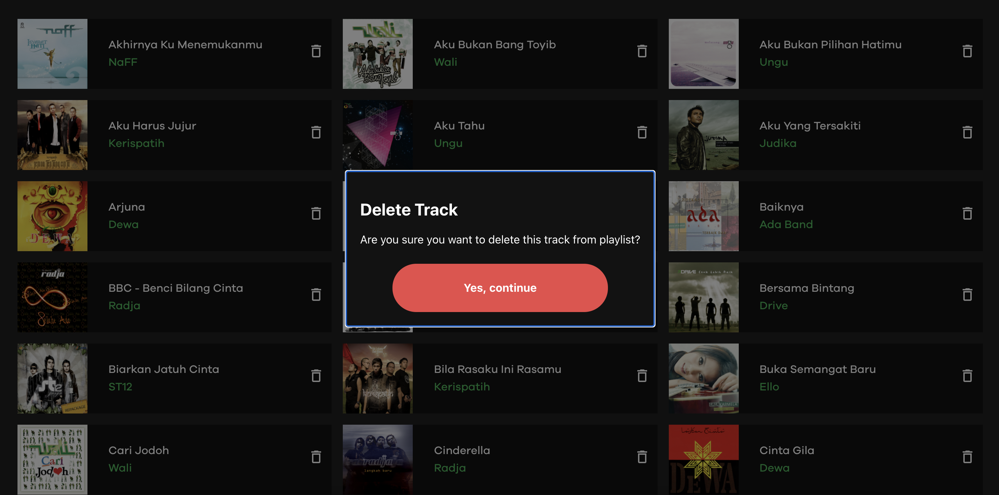

# Spotipu


### 💡 About the App
Spotipu is a simple React app that utilize Spotify's API to show user's playlist and tracks.

### 📜 Instruction
To start the application, please do the followings;
1. Install the dependencies
```
npm install
```
2. Run the projects. There are two commands, `npm run start` to run the React app, and `npm run start-service` to run Express app
```
npm run start
npm run start-service
```
3. The app can be accessed at;
```
http://localhost:3000/
```

### 👀 Preview

###### Login Page

User will be served with a simple login screen, which will redirect them to login with their Spotify account

###### Home Page

Once logged in, user is greeted with their name on top, followed with their email. Just below the user's informations, user can see their playlists. 

###### Playlist Page


User can choose one of the playlists there, and they will see all the tracks in the playlist.



In addition to viewing the tracks, user can delete tracks in the playlist. However, user can only delete tracks on the playlist they own, not playlists user follows.

### 👨🏻‍💻 Tech Stack
Spotipu is fully built with React and Express